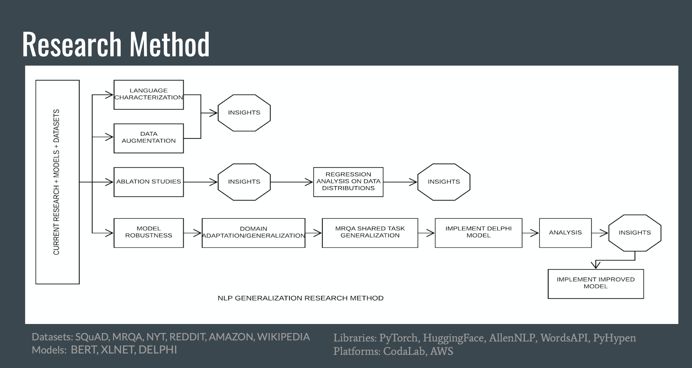

We are motivated to understand the challenges of generalization of natural language models on unseen data specifically for extractive question and answering tasks. We analyze existing studies for understanding the generalization gap, conduct experiments to further characterize the generalization gap and apply techniques used for improving model robustness on language models.

