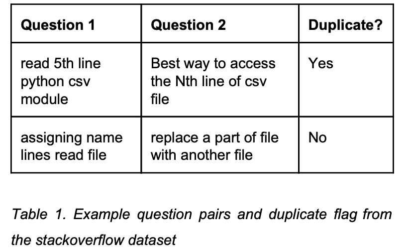

Abstract
We are motivated to understand the challenges of applying generalized natural language models to a technical language domain such as computer programming Q&A in order to reduce the amount of manual effort required by a programmer to find satisfactory answers to their questions. We apply and analyze existing approaches of learning sentence similarities and response prediction for Q&A tasks to other domains. Our methods train supervised neural models to predict question similarity and best response. In our experiments, we augment our models with Universal Sentence Encoder and BERT models and observe strong results for question pair similarity prediction, but more modest results for response prediction.

