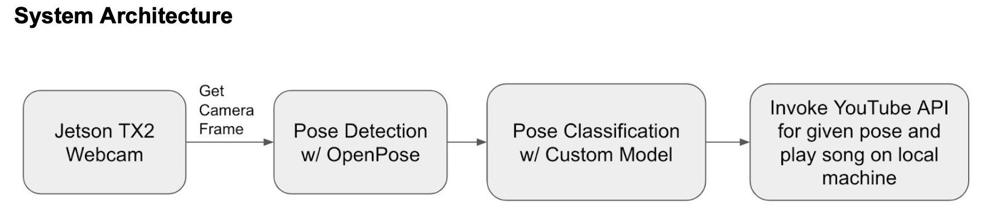

The objective of this project is to build a system called Jukestapose, which utilizes a neural network that detects human poses in an edge device then plays a corresponding song from Youtube according to the pose.
The neural network model in Jukestapose is built upon an existing deep learning system called OpenPose. The OpenPose model detects human poses in the camera, then a custom classification model is built on top of that to classify those detected poses.
Once a specific human pose is detected, Jukestapose will open a link on YouTube according to the pose and play the audio of that video in local media player.

The edge device used in this project is Jetson TX2 and a webcam. The Jetson TX2 will be constantly capturing through the camera. Each camera frame is obtained and sent through the OpenPose model for pose detection. Once a pose is detected, it will be sent through another custom model for pose classification. The custom model is a classification model with three categories: a dab pose, a t-pose, and all other. Finally, if a dab pose or a t-pose is detected, the sound of a YouTube video that contains the given pose will be played on local media player.

